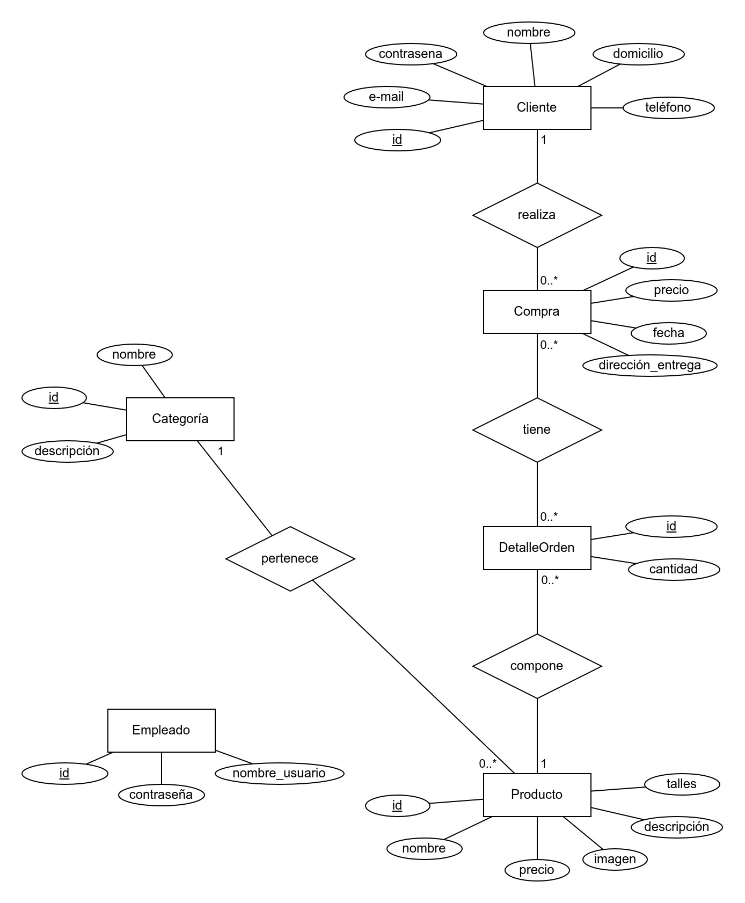

# Tienda online de Manos Argentinas 🙌️🇦🇷️
Nuestra ropa no te cambia, te muestra tal cual sos

## Idea general 🧠️
El sistema será un aplicación web para administrar la compra/venta de remeras artesanales del proyecto Manos Argentinas 
Los clientes podrán crearse cuentas, añadir al carrito y realizar compras de los diferentes productos que ofrece la página.
Por su lado, los empleados podrán subir, dar de baja y actualizar los productos
Sistema hecho por la comisión Algorithm Avengers (Silvestre Migliaro y David López)

## Modelo de entidad-relación 📚️

Las entidades modelan:
- Cliente: los clientes que pueden visualizar la página y hacer compras de productos por lote
- Empleado: los empleados que administran los productos que ofrece la página
- Producto: los productos, que pueden ser remeras, buzos, camisetas, etc
- Categoría: las diferentes categorías a las que puede pertenecer un producto (por ejemplo, un producto puede ser para hombre, adulto y buzo)
- DetalleOrden: un cliente puede comprar más de un mismo producto
- Compra: una vez que el cliente decide comprar todo lo que añadió al carrito, esto se convierte en una compra. El precio de la compra es la suma de los precios de los productos (multiplicados por la cantidad de cada uno)

## Proyecto Framework PHP - Laravel 👨‍💻️ 
- ¿Qué entidades se podrán actualizar?
	- Producto: lo pueden actualizar los empleados
	- Categoría: lo pueden actualizar los empleados
	- Empleados: lo pueden actualizar los empleados
	- Cliente: lo pueden actualizar los clientes
	
- ¿Qué reportes se podrán generar o visualizar?
	- Cliente: puede ver la lista de productos (puede listarlos por categoría) y su lista de compras
	- Empleado: puede ver la lista de productos, la lista de compras, la lista de categorías y la lista de clientes
	
- ¿Qué entidades se podrán obtener por API?
	Todas las entidades
	
- ¿Qué entidades se podrán modificar por API?
	Todas la entidades modificables

## Proyecto Javascript - React/Vue 💻️
- ¿Qué información podrá ver el usuario?
	El usuario cliente podrá ver la lista de productos (puede listarlos por categoría) y su lista de compras
	El usuario empleado podrá ver la lista de productos, la lista de compras, la lista de categorías y la lista de clientes
	
- ¿Qué acciones podrá realizar? Ya sea la primera vez que ingrese a la aplicación como futuros accesos a la misma
	El usuario cliente podrá crearse una cuenta (por primera vez), iniciar sesión, crear compras, cerrar sesión y modificar/eliminar su cuenta.
	El usuario empleado podrá crear/modificar/eliminar productos, crear/modificar/eliminar categorías, y modificar/eliminar su cuenta
